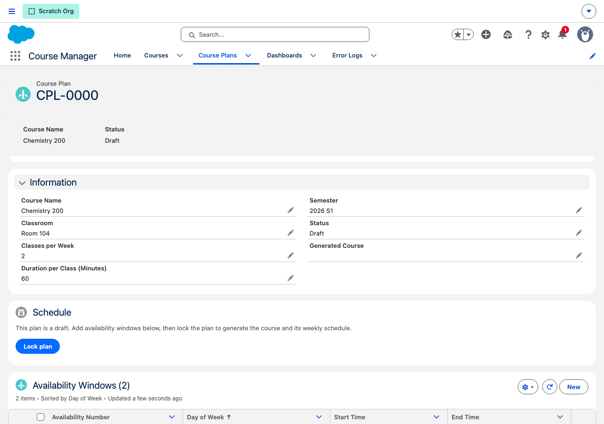
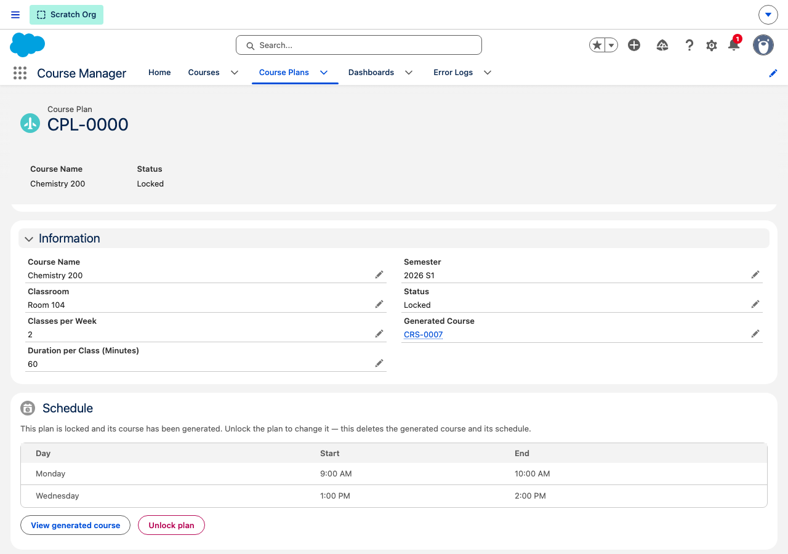
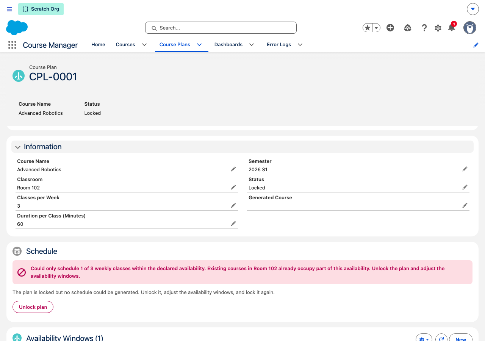

# Course Planning

Course planning inverts how courses are created: instead of instructors assembling a course and its time slots by hand, they declare **what** they want to teach and **when** they are available, and the system computes a conflict-free weekly schedule and generates the course. Instructors no longer have create/edit/delete access on courses or time slots — locking a plan is the only way a course comes into existence for them.

## Lifecycle

```
Draft ──(Lock plan)──► Locked + scheduled        (course + time slots generated)
Draft ──(Lock plan)──► Locked + scheduling error (nothing generated)
Locked ─(Unlock plan)─► Draft                    (generated course deleted, error cleared)
```

- **Draft** — the plan's fields and its availability windows are editable. Locking is available.

  

- **Locked + scheduled** — the scheduler found a valid assignment. A `Course__c` record with one `TimeSlot__c` per weekly class was generated; the plan links to it via **Generated Course** and shows the schedule.

  

- **Locked + unscheduled** — no valid assignment exists. The plan stays locked, nothing is generated, and the reason is stored on the plan and shown to the instructor.

  

Locked plans are immutable: field edits, deletes, and any change to availability windows are blocked by triggers until the plan is explicitly unlocked. **Unlocking deletes the generated course**, which cascades to its time slots *and any student enrollments* — the Unlock button shows a confirmation dialog (including the enrollment count) before proceeding.

## Data model

| Object | Purpose |
|--------|---------|
| `CoursePlan__c` | The plan header: `Course_Name__c`, `Classroom__c`, `Classes_Per_Week__c`, `Class_Duration_Minutes__c`, `Semester__c`, `Status__c` (Draft/Locked), `Scheduling_Error__c`, `Generated_Course__c` (lookup to the generated `Course__c`) |
| `Availability__c` | One weekly availability window per row (master-detail to the plan): `Day_of_Week__c`, `Start_Time__c`, `End_Time__c` |

The instructor is the plan's **owner**; the generated course sets `Instructor_User__c` to the plan owner. "Locked but unscheduled" is not a separate status — it is `Status__c = 'Locked'` with `Scheduling_Error__c` set and `Generated_Course__c` empty.

The `Semester`, `Classroom`, and `Day of Week` picklists are **Global Value Sets** shared with `Course__c` and `TimeSlot__c`, so the plan's values copy 1:1 onto the generated records.

## Scheduling algorithm

Implemented in `CoursePlanScheduler` (pure, fully unit-tested) and orchestrated by `CoursePlanLockService`:

1. Availability windows are sorted by day, start time, then Id — the algorithm is fully deterministic.
2. Existing time slots of **all** courses in the same classroom and semester are loaded as busy intervals.
3. Sessions are placed **round-robin across days** (one per day per round) so classes spread over the week instead of packing into the first window. Round-robin reaches the same total capacity as greedy packing for fixed-duration sessions, so it never fails where packing would succeed.
4. Within a day, each session takes the **earliest feasible start**: begin at the window start and jump past any conflicting busy interval. Intervals are half-open, so back-to-back sessions are allowed, and there is no step granularity — off-grid existing bookings (e.g. a 9:05 start) are handled exactly.
5. Placed sessions are added to the busy list, so a plan can never double-book itself, even with overlapping declared windows.

If fewer sessions fit than `Classes_Per_Week__c`, the lock **succeeds** but stores a message such as *"Could only schedule 1 of 3 weekly classes within the declared availability. Existing courses in Room 102 already occupy part of this availability."* — no partial schedule is ever produced.

## Classroom conflict detection

Because every scheduled plan owns a real `Course__c` with real `TimeSlot__c` rows, cross-plan conflict detection falls out of the same query that avoids manually created courses: the scheduler simply never places a session that overlaps an existing time slot in the same classroom and semester. Two plans locked one after the other for the same room schedule around each other automatically.

Known limitation: two *simultaneous* lock transactions for a classroom that has **no** courses yet can both pass the conflict check (there is no row to contend on). The lock serializes on the plan row and on the classroom's existing courses (`FOR UPDATE`), which closes every other case; the residual race is accepted at this app's scale, and any double-booking is visible on the calendar's overlap popover.

## Permissions

The `CourseInstructor` permission set changed with this feature:

| Object | Before | After |
|--------|--------|-------|
| `Course__c` | full CRUD | **read-only** |
| `TimeSlot__c` | full CRUD | **read-only** |
| `CoursePlan__c` | — | full CRUD (own records; Private sharing) |
| `Availability__c` | — | full CRUD (via parent plan) |

`Status__c`, `Scheduling_Error__c`, and `Generated_Course__c` are FLS read-only for everyone (including `CourseAdmin`) — state changes go through the Lock/Unlock actions only, and triggers block manual status flips even for admins.

Course generation runs in `CoursePlanLockService` (`without sharing`, system-mode DML) precisely because instructors lack create access on `Course__c`/`TimeSlot__c`, and because conflict detection must see other instructors' time slots (only day/start/end are used; the error message never names another course). The Edit-level `Course__Share` that `CourseHandler` creates for instructors is intentionally unchanged — with object-level edit revoked, it now grants effective read-only record access, and it is what lets the instructor see their generated course.

## Regenerating the screenshots

```bash
sf apex run --file scripts/apex/seed_course_plans.apex   # re-runnable; resets the demo plans
node scripts/update-doc-images.js course-planning.js
```

`scripts/update-doc-images.js` is a reusable orchestrator: it runs any per-feature script from `scripts/screenshot/` and copies each new datetime-prefixed PNG into `assets/` under its stable name. The course-planning script locks the seeded plans while capturing, so re-run the seed script first.

## Other known limitations

- Availability windows cannot cross midnight (`End_After_Start` validation rule).
- Overlapping windows on the same day are safe (no double-booking) but are not merged — a session never spans two windows. Declare the merged window if you want the union used.
- Two classes of the same course may land back-to-back or on the same day when availability is tight; spreading across days is best-effort, not guaranteed.
- Plans have no explicit instructor field; the owner is the instructor. An admin locking someone else's plan still generates the course with the plan owner as instructor.
