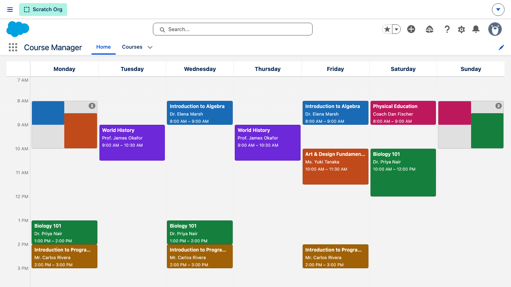

# Technical Guide

---

## For Admins

### Granting Access

Assign the **`CourseManagerAccess`** permission set to any user who needs access to the app.

```
Setup → Users → [select user] → Permission Set Assignments → Edit Assignments
```

What the permission set grants:

| Permission | Detail |
|------------|--------|
| App visibility | Course Manager Lightning app |
| Tab visibility | Courses tab |
| Course__c | Create, Read, Edit, Delete |
| TimeSlot__c | Create, Read, Edit, Delete |
| Course__c.Instructor__c | Read + Edit |

Users see only records they own (no org-wide "View All" or "Modify All").

---

### Configuring the Calendar

The calendar's display is controlled by a single Custom Metadata record:

```
Setup → Custom Metadata Types → Course Calendar Config → Manage Records → Default
```



| Field | Default | Description |
|-------|---------|-------------|
| Grid Start Hour | `7` | First hour visible on the time axis (0–23) |
| Grid End Hour | `21` | Last hour visible on the time axis (0–23) |
| Palette | 8 hex codes | Comma-separated colour codes assigned to courses in rotation |
| Height Pixels | `840` | Height of the calendar body in pixels |

Default palette: `#1A6BB5, #C04A1A, #15803D, #A16207, #6D28D9, #0F766E, #BE185D, #0369A1`

Changes to Custom Metadata take effect after the next page load — no deployment required for value-only edits in the same org.

---

### Page Layouts and App Navigation

| Component | Type | Purpose |
|-----------|------|---------|
| Course Manager | Lightning App | Top-level app; includes Home and Courses tabs |
| Course Manager Home Page Default | FlexiPage (HomePage) | Hosts the `courseCalendar` LWC on the Home tab |
| Course Record Page | FlexiPage (RecordPage) | Shows course highlights, details, and Time Slots related list |
| Course Layout | Page Layout | Field arrangement for the Course__c object |
| Time Slot Layout | Page Layout | Field arrangement for the TimeSlot__c object |

The app uses action overrides so that the Course__c record **View** action and the Home **Tab** action both redirect to the custom FlexiPages instead of the default Salesforce pages.

---

### Data Management

**Seed sample data** (7 courses, 18 time slots including overlaps):

```
Developer Console → Debug → Open Execute Anonymous Window
→ paste contents of scripts/apex/seed_courses.apex → Execute
```

Or via CLI:
```bash
sf apex run --file scripts/apex/seed_courses.apex
```

**Clear all courses and time slots:**

```bash
sf apex run --file scripts/apex/clear_courses.apex
```

---

## For Developers

### Prerequisites

- **Salesforce CLI** (`sf`): `npm install -g @salesforce/cli`
- **Node.js** ≥ 18 (for Jest, ESLint, Playwright)
- An **authorized Salesforce org** — see [devhub-setup.md](devhub-setup.md) for scratch org setup

```bash
npm install          # install dev tooling
sf org open          # open the default org in a browser
```

---

### Data Model

#### Course__c

| Field | API Name | Type | Required | Notes |
|-------|----------|------|----------|-------|
| Course Number | Name | AutoNumber `CRS-{0000}` | — | System-assigned, read-only |
| Course Name | Course_Name__c | Text(255) | Yes | Full title |
| Instructor | Instructor__c | Text(255) | No | Instructor name |

#### TimeSlot__c

| Field | API Name | Type | Required | Notes |
|-------|----------|------|----------|-------|
| Time Slot Number | Name | AutoNumber `TSL-{0000}` | — | System-assigned, read-only |
| Course | Course__c | Master-Detail(Course__c) | Yes | Cascade-deletes when parent is deleted |
| Day of Week | Day_of_Week__c | Picklist | Yes | Monday – Sunday (restricted) |
| Start Time | Start_Time__c | Time | Yes | |
| End Time | End_Time__c | Time | Yes | |

#### CourseCalendarConfig__mdt (Custom Metadata Type)

| Field | API Name | Type | Default |
|-------|----------|------|---------|
| Grid Start Hour | Grid_Start_Hour__c | Number | 7 |
| Grid End Hour | Grid_End_Hour__c | Number | 21 |
| Palette | Palette__c | LongTextArea | 8 hex codes |
| Height Pixels | Height_Pixels__c | Number | 840 |

---

### Deploying Changes

Always target the specific changed files — never deploy the entire source tree:

```bash
# Single file
sf project deploy start --source-dir force-app/main/default/classes/CourseCalendarController.cls

# Multiple files (e.g. controller and its test class together)
sf project deploy start \
  --source-dir force-app/main/default/classes/CourseCalendarController.cls \
  --source-dir force-app/main/default/classes/CourseCalendarControllerTest.cls

# If the org has conflicting state
sf project deploy start --source-dir <path> --ignore-conflicts
```

After deploying metadata that affects permissions (objects, fields, permission sets), verify access by opening the org and checking the affected record types.

---

### Running Tests

**Apex tests** (run all local tests):
```bash
sf apex run test --test-level RunLocalTests --synchronous
```

**Single Apex test class:**
```bash
sf apex run test --class-names CourseCalendarControllerTest --synchronous
```

**LWC unit tests (Jest):**
```bash
npm test                    # run once
npm run test:unit:watch     # watch mode
npm run test:unit:coverage  # with coverage report
```

**End-to-end tests (Playwright):**
```bash
npm run test:e2e            # headless
npm run test:e2e:ui         # with Playwright UI
npm run test:e2e:debug      # debug mode
```

---

### Capturing Documentation Screenshots

Screenshots for the docs live in `assets/` at the project root. To regenerate them:

1. Ensure the org has seed data:
   ```bash
   sf apex run --file scripts/apex/seed_courses.apex
   ```
2. Run the screenshot spec:
   ```bash
   npx playwright test --project=docs-screenshots
   ```
3. All seven PNGs are written to `assets/`.

The spec (`tests/capture-docs-screenshots.spec.js`) uses stored session state from the `setup` project — run `npx playwright test --project=setup` first if the session file is missing or expired.

---

### Migration Convention

Every change to a custom object or field requires a migration file alongside the metadata:

```
migrations/YYYY-MM-DD_<short-description>.md
```

Each file must include:

1. **What changed** — the metadata affected
2. **Deploy steps** — ordered `sf` CLI commands to apply the change
3. **Data backfill** (if needed) — anonymous Apex or Data Loader instructions
4. **Rollback** — how to reverse the change

See the existing files under `migrations/` for examples.

---

### LWC Architecture — courseCalendar

The component is wired entirely through `@wire` — no imperative Apex calls:

```
CourseCalendarController.getTimeSlots()  ──▶  @wire(getTimeSlots)
CourseCalendarController.getConfig()     ──▶  @wire(getConfig)
getPicklistValues (Day_of_Week__c)       ──▶  column order (Mon–Sun)
```

**Overlap detection** uses a Union-Find algorithm (`_resolveOverlaps()`): time slots on the same day are compared pairwise; any two that overlap in time are joined into the same group. Groups with more than one member render as a semi-transparent strip with a count badge instead of individual cards.

**Colour assignment** is done once per course (not per slot): courses are assigned colours from the `Palette__c` list in rotation. All slots for the same course share the same colour across days.

**Popover positioning** checks the card's position relative to the viewport and flips the popover to the left when the card is in the rightmost columns to avoid overflow.

---

### Adding a Feature

Follow this checklist for every new capability:

1. **Schema** — add fields or objects with `sf sobject generate field` or hand-write XML when the CLI is interactive-only
2. **Apex logic** — `sf apex generate class --name <Name>`
3. **Apex tests** — `sf apex generate class --name <Name>Test`; aim for ≥ 75 % coverage
4. **LWC** (if UI is needed) — `sf lightning generate component --type lwc --name <Name>`
5. **Migration file** — add `migrations/YYYY-MM-DD_<description>.md` with deploy, backfill, and rollback steps
6. **Deploy and verify**:
   ```bash
   sf project deploy start --source-dir <changed files>
   sf apex run test --test-level RunLocalTests --synchronous
   ```
