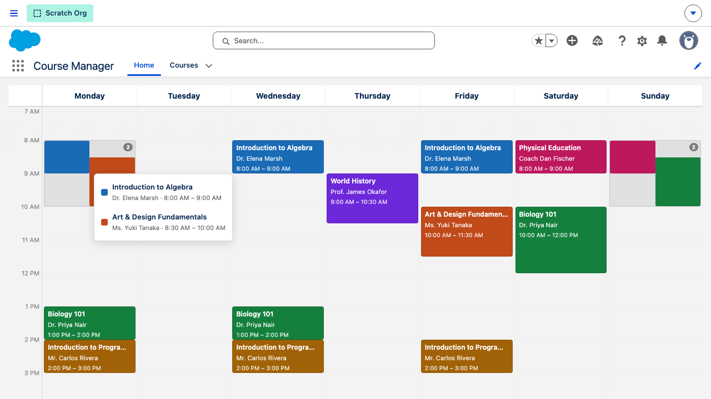
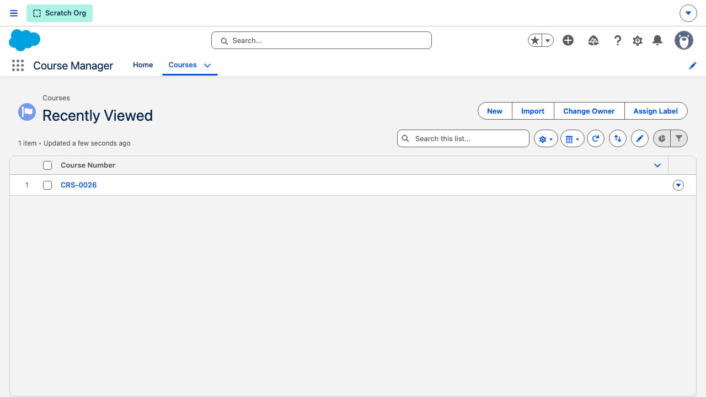
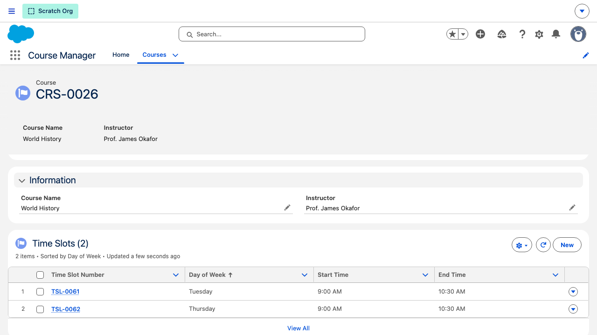
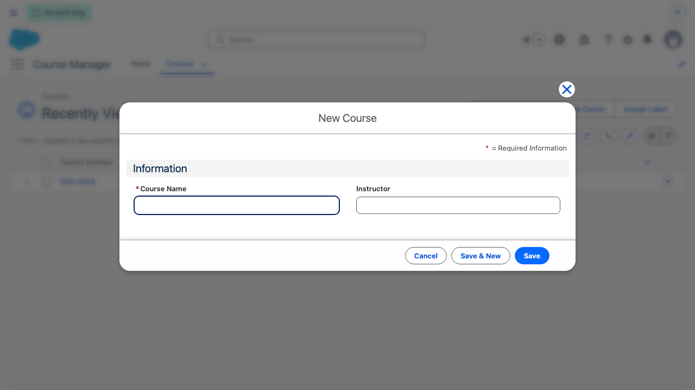
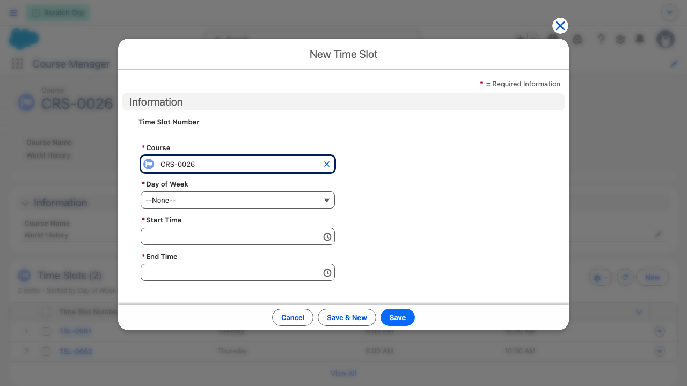

# User Guide

## Overview

The Course Management System lets you create courses, assign instructors, and schedule weekly time slots. A built-in calendar view displays all scheduled sessions in a colour-coded weekly grid so you can see the full schedule at a glance and spot conflicts.

---

## Opening the App

1. Click the **App Launcher** (nine-dot grid) in the top-left corner of Salesforce.
2. Search for **Course Manager** and click it.

The app opens to the **Courses** list by default. The **Home** tab shows the calendar.

---

## The Course Calendar

The calendar shows every scheduled time slot across a Monday–Sunday grid. The time axis runs along the left side (7 AM–9 PM by default). Each course is assigned a distinct colour that stays consistent across all of its time slots throughout the week.

---

## Overlapping Courses

When two or more courses share the same day and overlap in time, they are grouped into a single visual strip with a **numbered badge** showing how many courses are in the group.

Click the badge to open a **popover** listing every course in the group, each with its colour swatch and name.

Click any item in the popover to navigate directly to that course's record.

---

## Navigating to a Course Record

- **Single card** (no overlap): click the card to open the course record.
- **Overlap group**: click the badge, then click the course name in the popover.

---

## Courses List

The **Courses** tab shows all courses in a standard list view. Use the column headers to sort, or the search bar to filter by name.

---

## Course Record

A course record displays:

| Section | Fields |
|---------|--------|
| Highlights bar | Course Number (auto-assigned), Course Name, Instructor |
| Details | Course Name, Instructor |
| Time Slots related list | All scheduled sessions — Day, Start Time, End Time |

---

## Creating a Course

1. Go to the **Courses** tab and click **New**.
2. Fill in the fields:

| Field | Required | Description |
|-------|----------|-------------|
| Course Name | Yes | Full title of the course (up to 255 characters) |
| Instructor | No | Name of the instructor |

3. Click **Save**. The system auto-assigns a course number (e.g. `CRS-0001`).

---

## Adding Time Slots

A time slot represents one recurring session per week (e.g. every Monday 9:00–10:30 AM). Add as many slots as the course needs.

1. Open the course record.
2. In the **Time Slots** related list, click **New**.

| Field | Required | Description |
|-------|----------|-------------|
| Day of Week | Yes | Monday through Sunday |
| Start Time | Yes | Session start (24-hour or AM/PM format) |
| End Time | Yes | Session end |

3. Click **Save**. The slot appears in the calendar immediately.

---

## Editing and Deleting Records

**Inline edit (course record):** Click any field value on the course record page to edit it in place, then click **Save**.

**Edit a time slot:** Click the time slot row in the related list, then use the **Edit** action in the row-level menu (▼).

**Delete a time slot:** Use the **Delete** action in the row-level menu. Deleting a course deletes all of its time slots automatically.
